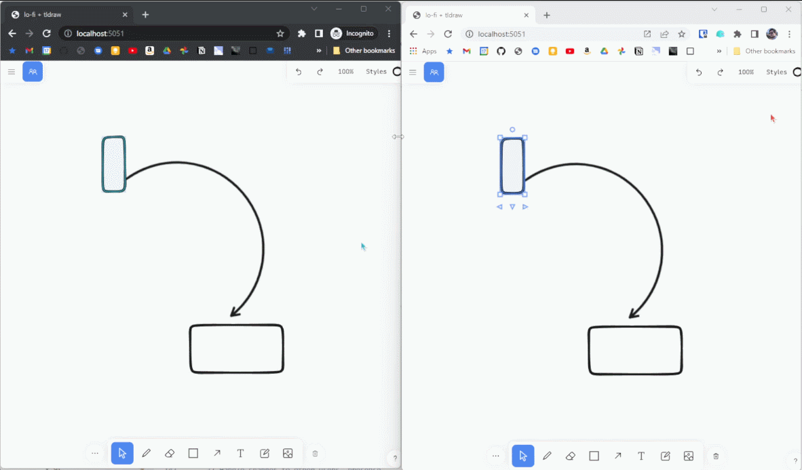

# lo-fi

An IndexedDB-powered database and data sync solution for lightweight, local-first web apps.

> ## Early software!
>
> I'm still rapidly iterating and experimenting with lo-fi in my own projects. Be aware that it's not ready for production usage yet and may change significantly in the near future, or include bugs which can cause data inconsistency!

## What does it do?

lo-fi is an end-to-end storage and sync framework for web apps. Out of the box, it helps you manage everything you need with local data:

- 🏦 Store everything in IndexedDB across sessions
- 🔎 Query your data using flexible indexes
- ⚡ React to changes instantly and automatically refresh queries
- 🛟 Full type safety based on your schema
- 🧳 Migrate your data model as your app grows and changes
- ⏳ Undo and redo changes

And then, on top of that, it includes an optional server which unlocks the power of sync and realtime:

- ☁️ Back up local data in your own server
- 💢 Robust conflict resolution for offline and real-time changes
- 🛂 Authenticate sync with your app's users
- 👋 Presence for real-time multiplayer
- 🔃 HTTP push/pull or WebSocket syncing, or upgrade on-the-fly

It does it all without any of this\*:

- 📈 Infinitely growing storage usage
- 🤔 Having to deeply understand CRDTs
- 🤝 Peer to peer networking
- 🚄 WASM-compiled databases in your browser

## [Read the documentation](https://a-type.github.com/lo-fi)

\* I'm aware most of these are good! But they also add complexity or fundamental changes in model, and the goal of lo-fi is to be simple and recognizable.
